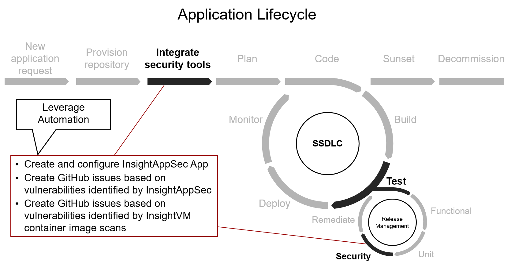

# rapid-power


This repository is dedicated to storing PowerShell functions and scripts related to automation leveraging Rapid7's REST APIs

# Table of Contents
* [Motivation](#Motivation)
* [Functions](#Functions)
* [Scripts](#Scripts)

# Motivation
Minimize development teams' effort to integrate and operationalize Rapid7 products. Within the Application Lifecycle, there are two primary phases when automation can assist in adoption and usage. 
- When integrating the Rapid7 Insight platform for the first time after the repository is created
- Once configurations for Rapid7 have been implemented for a repository, creating GitHub issues for vulnerabilities



# Functions
The below PowerShell functions are defined within the `/functions` directory of this repository. Be sure to see detailed Get-Help output that is defined for each function.  

- **Get-Rapid7AppSecApps** - Gets all the Apps in Rapid7 InsightAppSec.
- **Get-Rapid7AppSecAppScans** - Gets all the scans for a given Insight AppSec App.
- **Get-Rapid7AppSecAppVulnerabilities** - Gets all the vulnerabilities for a given App in Rapid7 InsightAppSec.
- **Get-Rapid7AppSecAttackDetails** - Gets all the attack details for a given attack module.
- **Get-Rapid7AppSecAttackModule** - Get information related to a given attack module.
- **Get-Rapid7AppSecAttackTemplates** - Gets all the attack templates in Rapid7 InsightAppSec.
- **Get-Rapid7AppSecEngineGroups** - Gets all the scan engine groups in Rapid7 InsightAppSec.
- **Get-Rapid7AppSecEngines** - Gets all the scan engines in Rapid7 InsightAppSec.
- **Get-Rapid7AppSecScanConfigOptions** - Gets all the detailed settings for a given scan config for a given Rapid7 InsightAppSec App.
- **Get-Rapid7AppSecScanConfigs** - Gets all the scan configs in Rapid7 InsightAppSec.
- **Get-Rapid7AppSecScans** - Gets all scans in Rapid7 InsightAppSec.
- **Get-Rapid7AppSecVulnerabilities** - Gets all the vulnerabilities in Rapid7 InsightAppSec.
- **Get-Rapid7AppSecVulnerability** - Gets a given vulnerability in Rapid7 InsightAppSec.
- **Get-Rapid7AppSecVulnerabilityDiscoveries** - Gets all the vulnerability discoveries for a given vulnerability in Rapid7 InsightAppSec.
- **New-Rapid7AppSecApp** - Creates a new App in Rapid7 InsightAppSec.
- **New-Rapid7AppSecAppScan** - Creates a new scan for a given Rapid7 InsightAppSec App and corresponding scan config.
- **New-Rapid7AppSecScanConfig** - Will create a new scan config for a given Rapid7 InsightAppSec App.
- **New-Rapid7AppSecTarget** - Will create a new target in Rapid7 InsightAppSec. 
- **Remove-Rapid7AppSecAppScan** -  Will remove a scan for a given Rapid7 InsightAppSec App. Only failed scans can be removed.
- **Set-Rapid7AppSecScanConfigAuthentication** - Sets the authentication settings for a given scan config on a given Rapid7 InsightAppSec App.
- **Set-Rapid7AppSecScanConfigScanScope** - Sets the URL that will be scanned for a given scan config on a given Rapid7 InsightAppSec App.
- **Stop-Rapid7AppSecScan** - Will stop a given scan for a given Rapid7 InsightAppSec App.
- **Get-Rapid7CloudSecInsights** - In progress...
- **Get-Rapid7CloudSecFilterRegistry** - In progress...
- **Get-Rapid7CloudSecInsightPacks** - In progress...
- **New-Rapid7CloudSecIaCScan** - In progress...
- **Get-Rapid7CloudSecFindings** - In progress...
- **Get-Rapid7CloudSecInsight** - In progress...

# Scripts
The below PowerShell scripts are defined within the `/scripts` directory of this repository. Be sure to see detailed Get-Help output that is defined for each script.  
- **New-Rapid7InsightAppSecApp.ps1** - This script creates a new Rapid7 InsightAppSec App, as well as configures the authentication mechanism and scan scope. 
- **New-Rapid7InsightAppSecScan.ps1** - This script executes a new scan for a given Rapid7 InsightAppSec App, and provides a JSON output to a specified directory. 
- **New-Rapid7InsightVMContainerImageScan.ps1** - This script initiates a new scan for a given container image, and provides a JSON output to a specified directory. 
- **Set-Rapid7InsightAppSecGitHubIssues.ps1** - This script creates a GitHub Issue for identified vulnerabilities. 

# Example InsightAppSec GitHub Action

A [GitHub Action](https://github.com/features/actions) for using [Rapid7](https://docs.rapid7.com/insightappsec/) for Dynamic Application Security Testing.

```yaml
name: rapid7-appsec-analysis
on:
  workflow_dispatch:
jobs:
  rapid7-appsec-analysis:
    runs-on: ubuntu-latest
    env:
      APP_NAME: # Rapid7 InsightAppSec App name goes here (e.g., tsg-web-webscantest-dev)
      SCAN_CONFIG_NAME: # Rapid7 InsightAppSec App scan config name goes here (e.g., 'Login page')
      MINIMUM_SEVERITY: # The minimum severity to report on goes here (e.g., low, medium, high)
    steps:
      - name: Checkout working repository
        uses: actions/checkout@v2
      - name: Checkout additional GitHub Actions repository
        uses: actions/checkout@v2
        with:
          repository: awshole/rapid-power
          token: ${{ github.token }}
          path: private-actions/rapid-power
      - name: Conduct Rapid7 InsightAppSec analysis
        uses: ./private-actions/rapid-power
        with:
          rapid7_api_key: ${{ secrets.RAPID7_TOKEN }}
          app_name: ${{ env.APP_NAME }}
          scan_config_name: ${{ env.SCAN_CONFIG_NAME }}
          minimum_severity: ${{ env.MINIMUM_SEVERITY }}
          github_repository: ${{ github.repository }}
          rapid7_github_integration_token: ${{ github.token }}
```

The Rapid7 InsightAppSec Action has properties which are passed to the underlying shell executing custom scripts. These are
passed to the action using `with`.

| Property                        | Required | Default | Description                                                                                                          |
|---------------------------------|----------|---------|----------------------------------------------------------------------------------------------------------------------|
| rapid7_api_key                  | TRUE     |         | Expects a string value corresponding to the API key to use when interacting with Rapid7 InsightAppSec.             |
| app_name                        | TRUE     |         | Expects a string value corresponding Rapid7 InsightAppSec App to execute a scan for.                               |
| scan_config_name                | TRUE     |         | Expects a string value corresponding to the scan config name to use when executing the scan.                       |
| minimum_severity                | TRUE     |         | Expects a string value corresponding to the minimum severity to include in scan results (e.g., low, medium, high). |
| github_repository               | TRUE     |         | Expects a string value corresponding to the GitHub repository to post a GitHub Issue to.                           |
| rapid7_github_integration_token | TRUE     |         | Expects a string value corresponding to the GitHub token to use for posting issues.                                |
| create_github_issues            | FALSE    | FALSE   | If this is true, details of the container image scan will be posted to the Issues tab of a repository.             |
| github_issue_assignee           | FALSE    |         | Expects a string value corresponding to the GitHub user to assign issues to if 'create_github_issues' is 'true'. |
